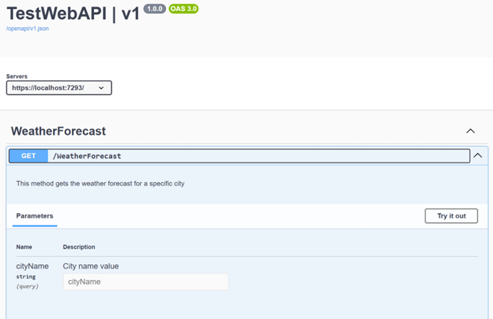
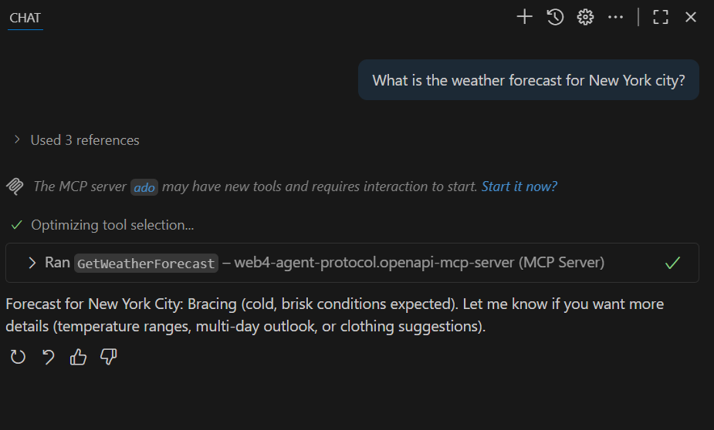
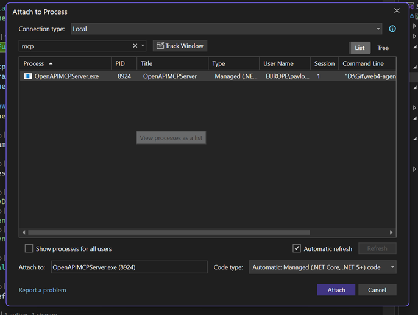
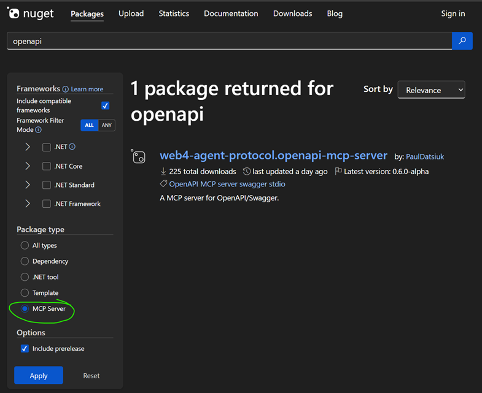
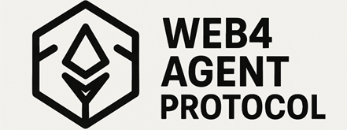

# Building an OpenAPI-Powered MCP Server in C# (Beginner’s Guide)

**Ever wish your AI assistant could directly call your REST API?** 

By combining an OpenAPI (Swagger) specification with the Model Context Protocol (MCP), you can transform any REST API into a set of AI-accessible tools. In this guide, you’ll build a simple MCP server in C# that automatically exposes operations from an OpenAPI spec (Swagger). It’s aimed at developers comfortable with basic .NET and REST APIs.

The template scaffolds a minimal MCP server project for you. To understand how it works, we’ll also implement the key parts.

## Prerequisites
* .NET 10 installed
* Basic familiarity with REST endpoints and JSON
* An existing API with an OpenAPI (Swagger) spec in JSON format
* Optional: VS Code + an MCP-aware client (e.g., GitHub Copilot Chat agent mode)

## 1. Scaffold a Minimal MCP Server

You can easily create the project with the following commands:

```powershell
dotnet new install Microsoft.Extensions.AI.Templates
dotnet new mcpserver -n MyMcpServer
```

### Defining a Tool

A static method marked with [McpServerTool](https://github.com/modelcontextprotocol/csharp-sdk) becomes an AI-callable MCP “tool”: the attribute plus parameter descriptions expose its name, purpose, and input schema so an LLM client can invoke it (here, to get a random number).

```csharp
public class MyTools
{
    internal class RandomNumberTools
    {
        [McpServerTool]
        [Description("Generates a random number between the specified minimum and maximum values.")]
        public int GetRandomNumber(
            [Description("Minimum value (inclusive)")] int min = 0,
            [Description("Maximum value (exclusive)")] int max = 100)
        {
            return Random.Shared.Next(min, max);
        }
    }
}
```

### Hosting the Server

This hosting snippet builds a minimal MCP server: create the generic host, register the MCP server with a [stdio transport](https://modelcontextprotocol.io/specification/2025-06-18/basic/transports), add the `RandomNumberTools` tool class, then run the process so an MCP client (LLM) can connect and invoke the tool.

```csharp
var builder = Host.CreateApplicationBuilder(args);

builder.Services
    .AddMcpServer()
    .WithStdioServerTransport()
    .WithTools<RandomNumberTools>();

await builder.Build().RunAsync();
```
The full code example is [here](https://github.com/JTOne123/web4-agent-protocol/blob/main/src/openapi-mcp-server/csharp/Program.cs)

For a deeper primer, see the [official quickstart guide](https://devblogs.microsoft.com/dotnet/mcp-server-dotnet-nuget-quickstart/).

## 2. Turning OpenAPI Operations into Tools

Goal: Load the OpenAPI spec and, for each operation, create a tool that performs the corresponding HTTP request.

Steps:
1. Load the OpenAPI JSON (local file or HTTPS endpoint).
2. Enumerate operations (method, path, parameters, descriptions).
3. Build a JSON schema for parameters so the MCP client (LLM) knows how to call the tool.
4. Invoke the API dynamically when the tool is executed.

### Sample ASP.NET API Controller (Example)

```csharp
[ApiController]
[Route("[controller]")]
public class WeatherForecastController : ControllerBase
{
    [EndpointDescription("This method gets the weather forecast for a specific city")]
    [HttpGet(Name = "GetWeatherForecast")]
    public string Get([Description("City name value")] string cityName)
    {
        return $"Weather forecast for {cityName}: {Summaries[Random.Shared.Next(Summaries.Length)]}";
    }
}
```
#### Swagger UI example


The full code example is [here](https://github.com/JTOne123/web4-agent-protocol/blob/main/src/misc/TestWebAPI/TestWebAPI/Controllers/WeatherForecastController.cs)

### Conceptual Dynamic Tool Implementation

Key responsibilities of the dynamic wrapper:
* Name = `operationId` (method name) derived from the OpenAPI operation
* Description = operation description from the spec
* Parameter schema = built from OpenAPI parameters
* Invocation = construct URL (path + query); add body if needed; send HTTP request; return response

```csharp
// Represents a single OpenAPI operation exposed as an AI-invocable function.
class WebApiOperationAIFunction : AIFunction // Derives from SDK base that defines invocation contract
{
    public override string Name => operation.OperationId; // Tool name shown to AI = OpenAPI operationId
    public override string Description => operation.Description; // Human readable description from spec
    public override JsonElement JsonSchema => GenerateOpenAICallSchema(operation); // JSON schema describing the tool's parameters
    public override JsonElement? ReturnJsonSchema => base.ReturnJsonSchema; // (Optional) return schema (not customized here for now)
    
    // ...

    // Builds a JSON schema object for the operation's parameters so the AI knows how to call it.
    private static JsonElement GenerateOpenAICallSchema(OpenApiOperation operation)
    {
        // ...

        foreach (var p in operation.Parameters) // Iterate all parameters defined in OpenAPI
        {
            properties.Add(p.Name, new JsonObject // Create schema entry for this parameter
            {
                ["type"] = MapType(p.Type), // Map OpenAPI type (string/int/etc.) to JSON schema type
                ["description"] = p.Description // Surface parameter description to the model
            });
        }

        JsonObject parametersObject = new JsonObject(); // Root schema object for all params
        parametersObject.Add("type", "object"); // Parameters are grouped into a single object
        parametersObject.Add("properties", properties); // Assign property schemas

        /// ...

        using var doc = JsonDocument.Parse(parametersObject); // Parse back into JsonDocument
        return doc.RootElement.Clone(); // Return a clone of the root element (safe outside using scope)
    }

    // Core async execution: builds HTTP request from AI-supplied arguments and returns raw response body.
    protected override async ValueTask<object?> InvokeCoreAsync(AIFunctionArguments arguments, CancellationToken cancellationToken)
    {
        var argDict = arguments.ToDictionary(); // Convert argument bag to dictionary for lookups

        /// ...

        // Build query string from parameters declared as "in: query".
        var queryParams = new List<string>(); // Collect encoded name=value pairs
        foreach (var qp in operation.Parameters.Where(x => x.In == "query")) // Only query parameters
        {
            if (argDict.TryGetValue(qp.Name, out var v) && v is not null) // If provided
            {
                queryParams.Add($"{Uri.EscapeDataString(qp.Name)}={Uri.EscapeDataString(v.ToString()!)}"); // Encode name and value
            }
        }

        var request = new HttpRequestMessage(new HttpMethod(operation.HttpMethod), urlBuilder.ToString()); // Create HTTP request with verb + full URL

        // For non-GET requests, gather non-path/query parameters into JSON body.
        if (!string.Equals(operation.HttpMethod, "GET", StringComparison.OrdinalIgnoreCase)) // Skip body for GET
        {
            var bodyParams = new Dictionary<string, object?>(); // Container for body fields
            foreach (var bp in operation.Parameters.Where(x => x.In != "path" && x.In != "query")) // Parameters intended for body/header/etc.
            {
                if (argDict.TryGetValue(bp.Name, out var v)) // If supplied
                    bodyParams[bp.Name] = v; // Add to body dictionary
            }

            /// ...
        }

        using var response = await httpClient.SendAsync(request, cancellationToken); // Execute HTTP call with cancellation support
        var content = await response.Content.ReadAsStringAsync(cancellationToken); // Read full response body as string

        return content; // Return raw body (could be improved to structured JSON later)
    }
}
```

The full code is [here](https://github.com/JTOne123/web4-agent-protocol/blob/main/src/openapi-mcp-server/csharp/AIFunctions/WebApiOperationAIFunction.cs)

### 2.1 Mental Model & Architecture (Why This Works)

Think of the MCP server as a thin adaptive layer between an LLM client and your existing REST API:

```
LLM (Copilot / Chat Client)
    |
    |  Discovers tools + schemas (names, params, descriptions)
    v
MCP Server (Tool registry + dynamic HTTP invoker)
    |
    |  Uses OpenAPI metadata to build requests
    v
Target REST API (Your existing endpoints)
```

The server does NOT “understand” business logic; it only:
* Advertises callable operations (tool surface)
* Validates and shapes parameters according to JSON schema
* Performs the HTTP request and returns raw/structured response

This separation lets you iterate your API independently while the MCP layer auto-adapts via the spec.

## 3. Running Locally vs Installed

Below are two MCP server configurations—one running directly from source code, one via the installed tool:

### /.vscode/mcp.json
```json
{
  "servers": {
    "web4-agent-protocol.openapi-mcp-server-local": {
      "type": "stdio",
      "command": "dotnet",
      "args": [
        "run",
        "--project",
        "X:\\Git\\web4-agent-protocol\\src\\openapi-mcp-server\\csharp\\OpenAPIMCPServer.csproj",
        "--",
        "https://localhost:7293/openapi/v1.json"
      ]
    },
    "web4-agent-protocol.openapi-mcp-server": {
      "type": "stdio",
      "command": "dnx",
      "args": [
        "web4-agent-protocol.openapi-mcp-server",
        "--version",
        "0.6.0-alpha", 
        "--yes",
        "--",
        "https://localhost:7293/openapi/v1.json"
      ]
    }
  }
}
```

Local development uses `dotnet`. Installation uses `dnx`.

You can apply this configuration in VS Code, Visual Studio, or any other MCP-compatible LLM client.

### 3.1 An example of what execution looks like


### 3.2 Debugging
Simply attach to the running process in Visual Studio.



## 4. Packaging as a .NET NuGet MCP Tool

Add these properties to your `.csproj`:

```xml
<PackAsTool>true</PackAsTool>
<PackageType>McpServer</PackageType>
<SelfContained>true</SelfContained>
<PublishSelfContained>true</PublishSelfContained>
```

Pack and publish:

```powershell
dotnet pack -c Release
dotnet nuget push .\bin\Release\*.nupkg --api-key <YOUR_API_KEY> --source https://api.nuget.org/v3/index.json
```

For internal use only, you can skip NuGet and distribute the built binary or use a private feed.

Here is a link to how the published NuGet looks: [web4-agent-protocol.openapi-mcp-server](https://www.nuget.org/packages/web4-agent-protocol.openapi-mcp-server/).



## 5. Recap

*   **Set up your C# MCP project** – install the MCP SDK, create a host, and prepare it to register tools.
*   **Integrate OpenAPI** – load the Swagger definition and programmatically register a tool for each API operation (each tool will call out to the real API).
*   **Test it** with an LLM client to make sure the tools work (use Swagger UI and the MCP Inspector / VS Code extension to verify).
*   **Distribute it** by publishing as a .NET tool if desired, so others can easily spin up the same MCP server.

By doing this, you enable any LLM-based assistant to interact with your API’s functionality safely and efficiently, without custom prompt engineering for every call. The heavy lifting (understanding endpoints, formatting requests) is handled by your MCP server and the OpenAPI spec, **letting AI focus on *what* to do, not *how* to call the API**. This is a huge productivity boost in building AI integrations.


## 6. A Note on the Web4 Agent Protocol (and Future Steps)

The work we’ve done falls under a broader concept we’re exploring called the **Web4 Agent Protocol** – an open standard aimed at letting AI agents not only read the web but also securely perform actions. The OpenAPI-to-MCP bridge is one piece of that vision: it **reuses existing REST APIs** (like a website’s API) by wrapping them in MCP so an agent can book a flight, post a comment, make a purchase, etc., on a user’s behalf. The *Web4 Agent Protocol* project (see [JTOne123/web4-agent-protocol on GitHub](https://github.com/JTOne123/web4-agent-protocol)) is our experimental playground for standardized authentication, authorization, and even **on-chain microtransaction** payment flows—features still in progress. What you have now is a solid foundation: **an OpenAPI-driven MCP server**. Try it with your own APIs—happy coding, and welcome to the future where AI agents can truly act for users!
 
### 6.1 Why This Matters As LLM Chatbots Reroutes the Web Traffic

We’re already seeing a shift where users ask an LLM chats instead of clicking through individual pages—meaning traditional pageview-driven discovery drops over time. If the only way an assistant can interact with your product is by brittle HTML scraping, you lose precision, performance, and the ability to safely expose richer, stateful flows (login, personalization, payments). By publishing an explicit contract (OpenAPI) and wrapping it with MCP, you teach every capable LLM exactly “what verbs your service speaks.” That unlocks scenarios far beyond passive parsing: authenticated actions, multi-step workflows, metered or microtransaction-backed operations, and auditable capability scoping. In short: less wasted token budget reverse‑engineering your DOM; more intentional, secure, capability-based integration. Opening your API to LLMs early positions your service to remain first‑class in an agent-centric traffic model instead of being an opaque blob the model only half understands.

